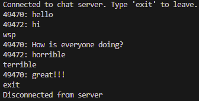

# Chat Server with Multiple Clients

'mychatclient.py': sends and receive messages from other clients connected to the same server
'mychatserver.py': Runs the TCP server, accepts multiple clients, and sends messages for other clients to receive
'README.py": Project description and usage

Example:

Server:

Client 1:

Client 2:

Client 3:

